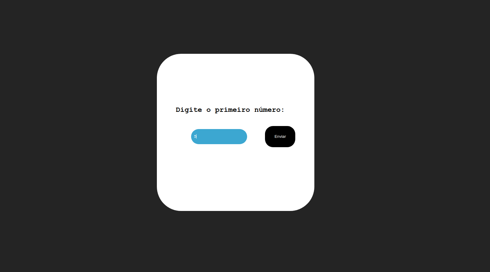
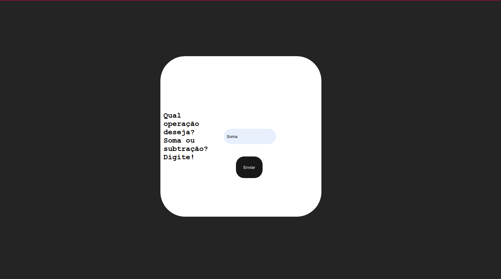
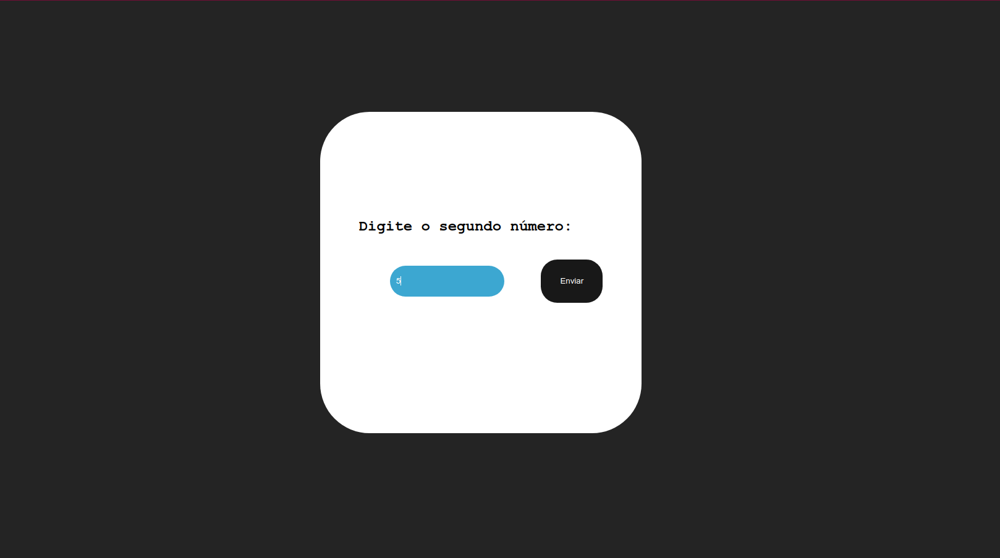
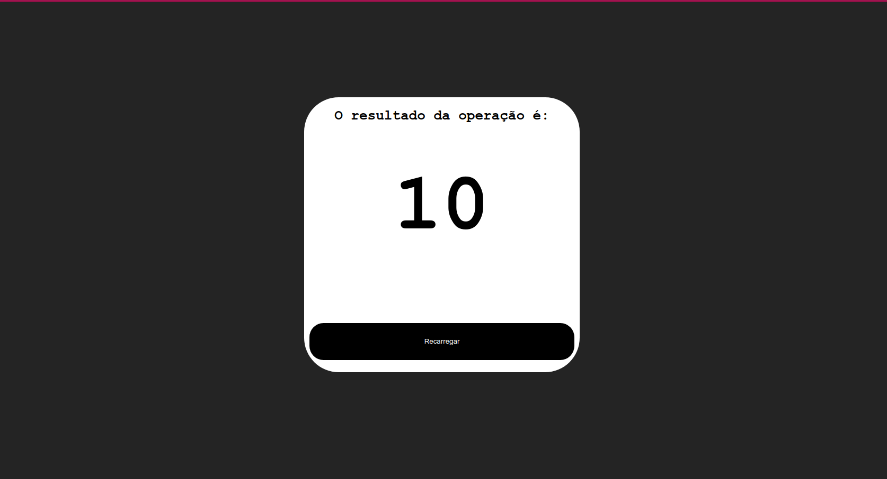

<h1 align="center">Soma ou Sub</h1>

<!--If you're usign a logo-->

Website desenvolvido por causa de um exercício do curso de desenvolvimento web completo 2021-Udemy

 
 

 <a href="#objective">Objective</a> • 
 <a href="#tecnologies">Tecnologies</a> • 
 <a href="#author">Author</a>

   

<h1>Status: ✅Complete✅</h1
 
 <!--Or you can use "🚧Under construction🚧"-->
 
  
 
<h1 id="objective">🎯 Objective</h1>
 

Criar um sistema simples de soma e subtração, utilizando conceitos de validação de formulário e testar minhas habilidades com desenvolvimento web

 
  
 
 
<h1 id="tecnologies">💻 Tecnologies</h1>
 
<ul>
 <li>HTML<!--And you can put the link to the tecnologies--></li>
 <li>CSS<!--And you can put the link to the tecnologies--></li>
 <li>Javascript<!--And you can put the link to the tecnologies--></li>
</ul>

  
 

<h1 id="printscreen">📷 Printscreen</h1>
<!-Or you can use GIFs =D--->
        

  

<h1 id="author" align="center">Author</h1>

Wilson Júnior</h1>
 
